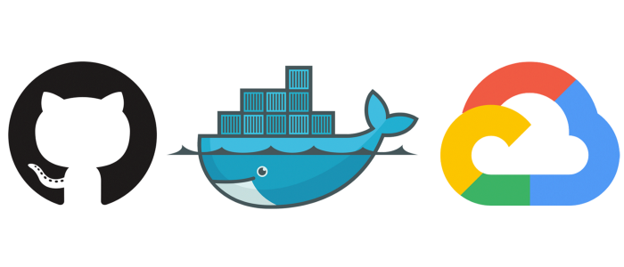

<div align="center" id="top">



</div>

<h1 align="center">Cloud Run App with Github Actions</h1>

<p align="center">
  
  
  
  
  <!--  -->
  <!--  -->
  <!--  -->
</p>

<p align="center">
  <a href="#dart-about">About</a> &#xa0; | &#xa0; 
  <a href="#rocket-technologies">Technologies</a> &#xa0; | &#xa0;
  <a href="#white_check_mark-requirements">Requirements</a> &#xa0; | &#xa0;
  <a href="#checkered_flag-starting">Starting</a> &#xa0; | &#xa0;
  <a href="#memo-license">License</a> &#xa0; | &#xa0;
  <a href="https://github.com/devenes" target="_blank">Author</a>
</p>

<br>

## :dart: About

This project is a simple app to test the cloud run with github actions.

## :rocket: Technologies

The following tools were used in this project:

- [Google Cloud](https://cloud.google.com/)
- [Golang](https://golang.org/)
- [Docker](https://www.docker.com/)

## :white_check_mark: Requirements

Before starting :checkered_flag:, you need to have [Google Cloud](https://cloud.google.com/) account and the service account with the required roles.

## 🔐 Authorization

You will need to authenticate to Google Cloud as a service account with the following roles:

- Cloud Run Admin
- Cloud Build Service Account
- Cloud Run Service Agent
- Viewer

## :checkered_flag: Starting

You can run this project locally:

```bash
# Clone this project
git clone https://github.com/devenes/cloud-run-action

# Access
cd cloud-run-action

# Run the project
go run main.go

# The server will initialize in the http://localhost:8080
```

## :memo: License

This project is under license from MIT. For more details, see the [LICENSE](LICENSE) file.

Made with :heart: by <a href="https://github.com/devenes" target="_blank">devenes</a>

&#xa0;

<a href="#top">Back to top</a>
